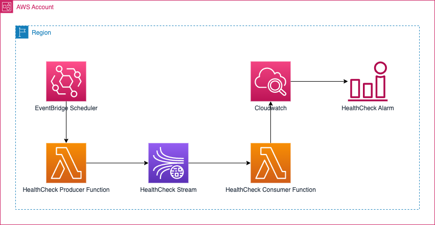

# Health Check Kinesis Data Streams service 

This sample aims to demonstrate health checking the Kinesis Data Streams service by producing a tracer message 
to a health-check stream and consuming it, to produce a realtime custom metric to CloudWatch. The custom metric can in
turn be used to setup an Alarm for immediate alerting in case producing and consuming capabilities to the service
are impaired.

# Architecture



* EventBridge Scheduler is used to setup a rule to trigger the HealthCheck Producer 
  function at an interval of every 1 minute.
* The Producer function upon invocation produces a message to Kinesis Data Streams `health-check-stream` stream, with
  the below data, where the timestamp is the current UTC time at the time of producing the message
 
    `{"currentInstant":"2022-10-17T10:00:00Z"}`
* The Consumer function is setup with an Event Source mapping to the Health Check stream, hence is invoked with a 
  batch of records available in the stream. 
* The consumer function calculates the time duration difference between the current UTC time and the timestamp from 
  the healthcheck message. 
* The duration difference in seconds is written to Cloudwatch as a custom metric.
* An alarm is setup that goes into Alarm state if the duration is more than 1 second in the last data point or if 
  the last data point is missing.

    
# Prerequisites

To deploy this, you will need AWS CDK installed on your machine. 

# Project Structure

The project contains three folders.
* infrastructure - CDK stack that deploys the following components.
  * Health Check Stream in Kinesis Data Streams 
  * Event Bridge rule to fire every minute and invoke the Producer function with a constant input.
  * IAM Role with necessary permissions for both the functions
  * HealthCheck Producer Function
  * HealthCheck Consumer Function
  * CloudWatch Alarm using the custom metric published by the consumer Lambda
* kinesis-healthcheck-producer-function - Contains the Lambda code for producing HealthCheck tracer messages
* kinesis-healthcheck-consumer-function - Contains the Lambda code for consuming HealthCheck tracer messages

# Deploy the sample application

1. In the folder `infrastructure`, perform the following
    
```   
cdk synth
```

2. After verifying the Cloudformation template generated by the above command, proceed with deployment

```
cdk deploy --all --outputs-file ../out.json
``` 

# Cleanup

Run the below command to destroy the stack

```
cdk destroy --all --outputs-file ../out.json 
```

# Security
See [CONTRIBUTING](CONTRIBUTING.md#security-issue-notifications) for more information.

# License
This library is licensed under the MIT-0 License. See the LICENSE file.